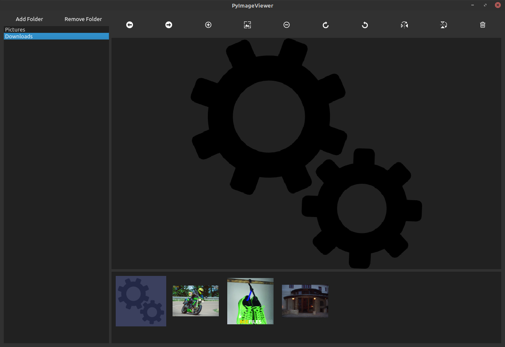

# PyImageViewer

## Summary
This image viewer was written in Python3 using PySide2 (Qt5) library.

## Main features
1. User can open the program directly: this way, on the left we will get a folder list, where we can add sources with picutres.
  a. User can navigate in the selected folder between the pictures
  b. Pictures can be mirrored, rotated, deleted from the navigation bar above the picture or zoom in and out.
2. User can open pictures with the PyImageViewer: this way user will see only the picture without the left pane.
  a. Pictures can be mirrored, rotated, deleted or zoom in and out.

## Setup
The 'requirements.txt' contains all the dependecies which must be installed.

## How to run
- Windows: PyImageViewer.bat or  
- Linux: PyImageViewer.sh
- CLI: any from above or `python3 main.pyw`

## Screenshots

